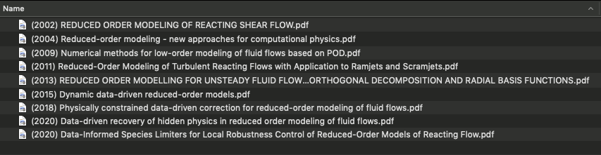
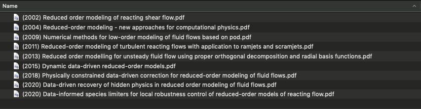

# 🎓 Python scripts to manage your bibliography

## Print the tags to all bibliography items in a `.bib` file

► [`list-bib-items-tags.py`](list-bib-items-tags.py)

Running this script on your `.bib` file will print something like this:

```
----------------------------------------
bellemans2018feature
cantera
echekki2015principal
gri30
kaufman2009finding
may2010data
niu2013
parente2011
prufert2015constrained
roweis2000nonlinear
scikit-learn
sutherland2009
szekely2007measuring
taylor1993multicomponent
tenenbaum2000global
thrun2021fundamental
van2008visualizing
yang2013empirical
yetter1991comprehensive
zhang2020large
----------------------------------------
```

The only thing you need to set in the script is the path to your `.bib` file:

```python
directory = './'
bib_filename = 'dissertation-bib.bib'
```

## Has an item from a `.bib` file been cited in a `.tex` source file?

► [`is-it-cited.py`](is-it-cited.py)

Running this script on your `.bib` and `.tex` files will print a list of tags to bibliography items that have or have not been cited in your `.tex` source file. This will look something like this:

```
----------------------------------------
Citation not used: bray2005
Citation not used: buda2018
Citation not used: cox2008multidimensional
Citation not used: gicquel2000
Citation not used: gill2004improving
Citation not used: gri30
Citation not used: jolliffe2002
Citation not used: scikit-learn
Citation not used: szekely2007measuring
Citation not used: taylor1993multicomponent
Citation not used: tenenbaum2000global
Citation not used: van2008visualizing
Citation not used: yang2013empirical
Citation not used: yetter1991comprehensive
Citation not used: zhang2020large
      TOTAL NOT USED: 15
----------------------------------------
```

```
----------------------------------------
Citation used: isaac2015
Citation used: kambhatla1997dimension
      TOTAL USED: 2
----------------------------------------
```

The only thing you need to set in the script is the path to your `.bib` and `.tex` files:

```python
directory = './'
tex_filename = 'dissertation.tex'
bib_filename = 'dissertation-bib.bib'
```

## Find duplicate bibliography items tags in a `.bib` file

► [`duplicate-tags.py`](duplicate-tags.py)

Running this script on your `.bib` file will print something like this:

```
----------------------------------------
Spitfire
buda2018
coussement2012kernel
echekki2015principal
gill2004improving
hawkes2007scalar
isaac2015
jolliffe2002
macqueen1967some
may2010data
mirgolbabaei2014nonlinear
owoyele2017toward
parente2009identification
parente2013principal
pope2013small
russell2002artificial
scikit-learn
sutherland2009combustion
yang2013empirical
zhang2020large
	20 DUPLICATE TAGS FOUND.
----------------------------------------
```

The only thing you need to set in the script is the path to your `.bib` file:

```python
directory = './'
bib_filename = 'dissertation-bib.bib'
```

## Count the number of bibliography items in a `.bib` file

► [`count-bibliography-items.py`](count-bibliography-items.py)

Running this script on your `.bib` file will print something like this:

```
----------------------------------------
Total bibliography items:	69
	Journal articles:	55
	Textbooks:		5
	In proceedings:		3
	In collection:		3
	PhD theses:		1
	Miscellaneous:		2
----------------------------------------
```

The only thing you need to set in the script is the path to your `.bib` file:

```python
directory = './'
filename = 'dissertation-bib.bib'
```

## Rename bibliography files to lower-case

► [`rename-bibliography-files.py`](rename-bibliography-files.py)

Running this script will get you from this:



to this:



The only thing you need to set in the script is the path to the directory where your downloaded literature items sit:

```python
path = './'
```

Note, that it will be ran recursively in all subdirectories of `path`.
